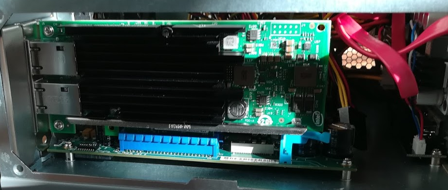
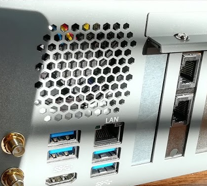
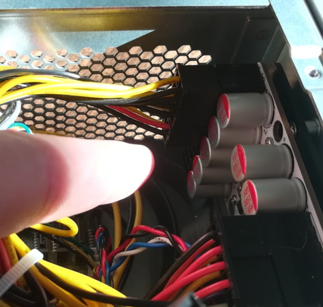
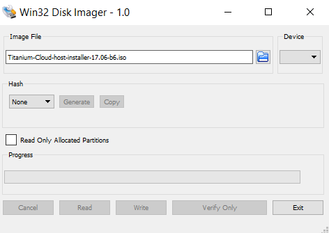
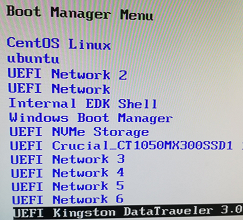
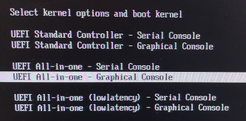

# Wind River&reg; Titanium Cloud on the Intel&reg; Fog Reference Design platform - Simplex

### Simplex Hardware Configuration


Typical Intel&reg; Fog Reference Design (FRD) platform Specifications:

- Intel® Xeon® processor-E3
- 2x8 PCIe
- C236 (server chipset)
- 32GB DDR4 ECC
- WiFi BT M.2 module
- M.2 PCIe x2 SSD
- 4 SATA
- 6 USB
- AMT/VPro/TXT
- TPM2.0, PTT
- Arduino off FPGA
- 3G/4G on PCIe


Additional hardware required to install Titanium Cloud on the FRD:

- Intel X540T2 Converged Network Adapt T2 - [Amazon](https://www.amazon.com/Intel-X540T2-Converged-Network-Adapt/dp/B0077CS9UM/)
- Crucial MX500 1TB 3D NAND SATA 2.5 Inch Internal SSD - [Amazon](https://www.amazon.com/Crucial-MX500-NAND-SATA-Internal/dp/B077SF8KMG/)
- Any SATA 6Gbps Cable - Example on [Amazon](https://www.amazon.com/Monoprice-108782-18-Inch-6Gbps-Locking/dp/B009GUX8YK/)
- Any USB 3.0 Flash Drive - Example on [Amazon](https://www.amazon.com/Samsung-METAL-Flash-MUF-32BA-AM/dp/B013CCTM2E/)


Install the Network Adapter into PCI Slot 2 to avoid the adapter hitting the capacitors at the end of Slot 1.






Install the SSD by attaching the SATA cable to the SSD and SATA 0.  In order to power the SDD, you must use the power adapter that came with the FRD.  This power adapter connects to the backplane of the power supply inside the FRD.  See the pictures below.




The SSD can mount on the underside of the upper rack:


The platform should look something like this when you have added the Network Adapter and the SSD:


### Get Wind River Titanium Cloud Software

You can either get access to the latest software through your Wind River representative or if you have Windshare access you can obtain it there.

Log into https://windshare.windriver.com/ with your Wind River account.  If you don't have account

TODO - how to get an account


Download the lasted version of Titanium Cloud as well as the license file.  If you do not have access to a license file, contact your Wind River representative.

### Copy Wind River Titanium to USB Flash Drive

In Windows you can use Win32 Disk Imager to write the ISO to the USB flash drive:




In Linux you can use dd to write the image to a USB Flash drive similar to the following:

```
sudo dd if=Titanium-Cloud-host-installer-XX.XX-XX.iso of=/dev/sdX bs=4m && sync
```

Where /dev/sdX is the USB Flash drive.

### Boot Install from the USB Flash Drive

Connect a Monitor, USB Keyboard and the FRD Power Supply.

Insert the USB Flash Drive into one of the front USB ports on the FRD.  Turn on the power.

During the power on memory test, press the F2 key repeatedly in order to get into the Boot Menu.  Select the Boot Menu then highlight your USB drive and UEFI boot it.



The following selection will install using the graphical console to /dev/sda which will be mapped to the 1TB SSD we installed:



Monitor the installation until it is complete.  Remove the USB Flash Drive to ensure that the system boots from the SSD.

Log into the host as wrsroot, with password wrsroot.

The first time you log in as wrsroot, you are required to change your password.  For the kit we are using the default password **FRD4you!**

TODO - is there a better default password?

```
Changing password for wrsroot.
(current) UNIX Password:
```

Enter the current password (wrsroot).

```
New password:
```

Enter a new password for the wrsroot account.

```
Retype new password:
```

### Copy the License

Copy the Titanium Cloud license file to /home/wrsroot/license.lic on the controller.

For an OAM network connection, use an scp command similar to the following:

```
scp username@sourcehost:sourcepath/license.lic /home/wrsroot
```

For a USB drive, use a cp command similar to the following:

```
cp /media/sdc/license.lic /home/wrsroot
```

### Applying Patches

To ensure that the Titanium Cloud software is fully up to date, apply any patches immediately after initializing controller-0 with software.

1. Copy the patches from a connected server.

  ```
  $ scp username@sourcehost:sourcepath/patchfile /home/wrsroot
  ```

  Use the following command, adjusting the media mount point as needed, if you are using a
  USB flash drive instead:

  ```
  $ cp /media/sdc/patchfile /home/wrsroot
  ```

2. Upload the patches to the patch storage area.

  ```
  $ sudo sw-patch upload ./patchfile
  ```

3. Apply the patches.

  ```
  $ sudo sw-patch apply --all
  ```

4. Install the patches locally.

  ```
  $ sudo sw-patch install-local
  ```

  This command applies and installs all applied patches on controller-0.

  **WARNING: You must run sw-patch install-local from the controller-0 console. If you run it from an SSH connection, the script fails, and to recover, you must re-install the Titanium Cloud software.**

  NOTE: You must reboot the controller to ensure that it is running with the software fully patched.

5. Execute the following command to reboot controller-0.

  ```
  $ sudo shutdown -r now
  ```

  Patch installation is complete.

### Configure controller-0

Copy the ini file from the Copy the ini from a connected server.

```
$ scp username@sourcehost:sourcepath/ini /home/wrsroot
```

Use the following command, adjusting the media mount point as needed, if you are using a
USB flash drive instead:

```
$ cp /media/sdc/ini /home/wrsroot
```

Run the following command to initiate the controller configuration.

TODO - how do we use the ini file?

```
$ sudo config_controller
Titanium Cloud Configuration
======================================
Enter Q at any prompt to abort...
```

After a few minutes, the message **Configuration was applied** appears.

